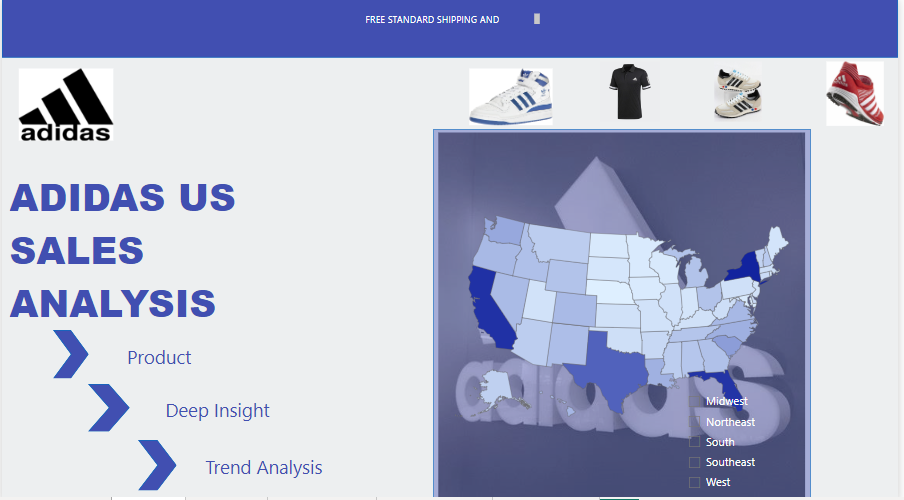

ADIDAS US SALES ANALYSIS

OBJECTIVES

    The objectives of this project are clearly stated below:
&#8226; To identify sales across various product lines between the year 2020-2021.

&#8226; To describe sales of products by different retailers, regions and states per year.

&#8226; To analyze trends of products per month.

DATA SOURCE

The dataset for this project is secondary data from https://docs.google.com/spreadsheets/d/1g3Nm0MU90F_LRvcqNGIn5p9mB7xNUCXB/edit?usp=drive_link&ouid=105630931357721511944&rtpof=true&sd=true

DATA CLEANING

Power Query editor was used for the cleaning and PowerBI was used for the visualization.

This data consists of three different sheets.

The Data Sales Adidas sheet:

&#8226; The first 4 rows were removed

&#8226; The first row was used as header

&#8226; Changed text type

The Location sheet:

&#8226; The first 3 rows were removed

&#8226; The first row was used as header

The Product sheet:

&#8226; The first row was used as header

INSIGHTS

&#8226; Out of the different product lines “Men’s Street Footwear”  had the highest amount of sales at $208.83M and 593 units sold while "Women Athletic Footwear” had the least sales at $106.63 and 317 units sold.

&#8226; In 2020, “West Gear” had the highest sales from the West while “Kohi” had the lowest sales from the Midwest. In the year 2021, “Foot Locker” had the highest sales from the West while “Walmart” had the lowest sales from the Southwest.

&#8226; In 2020 April made more sales and profit and December made the least sales and profit. In 2021 December made more sales and profit while March made the least sales and profit.

&#8226; In 2020 April had the highest sales and profit of in-store purchase while November had the least. April had the highest sales and profit of online purchase while December had the least. June had the highest sales and profit for purchase from other outlets while July had the least. 2021 July had the highest sales and profit from instore purchase while March had the least sales and profit. December had the highest sales and profit from online purchase while March had the least. January had the highest sales and profit for purchase from other outlets while June had the least.

